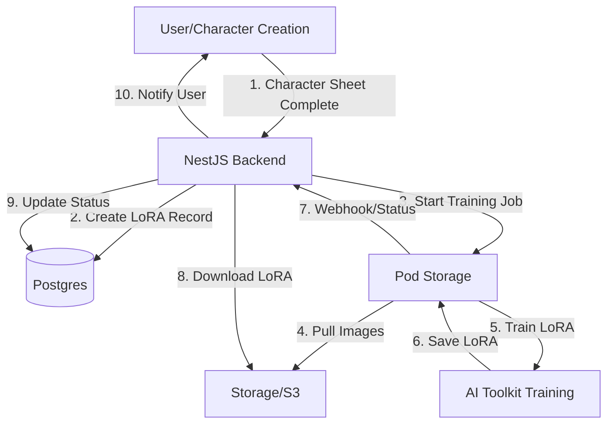

# AI Toolkit LoRA Training Integration

> **Based on**: [Hyperrealistic Consistent Characters Workflow](./../../research/youtube-videos/PhiPASFYBmk/analysis.md)  
> **Status**: Design Phase  
> **Date**: 2025-01-27

## Overview

Automated LoRA training backend using **AI Toolkit** (by Ostrus AI) on RunPod. This enables character-specific LoRA training for consistent character generation in EP-001 and EP-005.

## Architecture



## AI Toolkit Setup

### Official Repository

**GitHub**: https://github.com/ostris/ai-toolkit  
**Creator**: Ostris  
**License**: MIT  
**Stars**: 8.8k ⭐

### RunPod Template

**Template**: "AI Toolkit" by Ostris  
**Template ID**: (to be discovered via RunPod console)  
**Official Template**: Maintained by creator (mentioned in README)

**Configuration**:
- **GPU**: RTX 5090 (recommended) or RTX 4090 (works)
- **Container Disk**: 50GB+ (for models and training data)
- **Network Volume**: Optional (for persistent model storage)
- **Ports**: HTTP service (default port from template)
- **Environment Variables**:
  - `PASSWORD`: Set custom password for AI Toolkit web UI

### Access Pattern

AI Toolkit uses **Gradio** for its web interface, which automatically exposes API endpoints:

1. **Gradio API**: Standard Gradio API endpoints at `/api/`
2. **Dataset Management**: Create datasets, upload images
3. **Job Management**: Create training jobs, monitor progress
4. **Model Download**: Download trained LoRA files

**Gradio API Discovery**:
- Access `/docs` endpoint for API documentation
- Standard Gradio endpoints: `/api/predict`, `/api/`, etc.
- Can also use browser DevTools to discover endpoints

## Implementation Plan

### Phase 1: Infrastructure Setup

#### 1.1 RunPod Pod Deployment

**Option A: Persistent Pod** (Development/Testing)
- Deploy AI Toolkit pod via RunPod template
- Keep running for testing
- Access via HTTP endpoint

**Option B: On-Demand Pod** (Production)
- Deploy pod when training needed
- Stop pod after training completes
- More cost-effective ($0 when idle)

**Implementation**:
```typescript
// Use RunPod MCP or API to deploy pod
const pod = await runpod.createPod({
  name: 'ryla-ai-toolkit',
  templateId: 'ai-toolkit-ostrus', // Template ID
  gpuTypeIds: ['RTX_5090'], // or RTX_4090
  containerDiskInGb: 50,
  env: {
    PASSWORD: process.env.AI_TOOLKIT_PASSWORD,
  },
});
```

#### 1.2 AI Toolkit API Client

Create a client to interact with AI Toolkit's HTTP interface:

```typescript
// libs/business/src/services/ai-toolkit-client.ts
export class AIToolkitClient {
  private baseUrl: string;
  private password: string;

  async createDataset(name: string, imageUrls: string[]): Promise<string>
  async createTrainingJob(config: TrainingJobConfig): Promise<string>
  async getJobStatus(jobId: string): Promise<JobStatus>
  async downloadLoRA(jobId: string, version: string): Promise<Buffer>
}
```

### Phase 2: Backend Service

#### 2.1 LoRA Training Service

```typescript
// apps/api/src/modules/lora/services/lora-training.service.ts
@Injectable()
export class LoraTrainingService {
  async startTraining(input: {
    characterId: string;
    userId: string;
    imageUrls: string[];
    baseModel: 'one-2.1' | 'one-2.2' | 'flux' | 'z-image-turbo' | 'sdxl' | 'sd-1.5';
    triggerWord: string;
  }): Promise<{ loraModelId: string; trainingJobId: string }>

  async checkTrainingStatus(loraModelId: string): Promise<LoraModel>

  async downloadTrainedLoRA(loraModelId: string): Promise<void>

  private async ensureAIToolkitPod(): Promise<string> // Pod ID
}
```

#### 2.2 API Endpoints

```typescript
// apps/api/src/modules/lora/lora.controller.ts
@Controller('lora')
export class LoraController {
  @Post('training/start')
  async startTraining(@Body() dto: StartLoraTrainingDto)

  @Get('training/:loraModelId/status')
  async getTrainingStatus(@Param('loraModelId') loraModelId: string)

  @Post('training/:loraModelId/download')
  async downloadLoRA(@Param('loraModelId') loraModelId: string)
}
```

### Phase 3: Integration Points

#### 3.1 Character Sheet Completion Hook

When character sheet generation completes, automatically start LoRA training:

```typescript
// In character-sheet.service.ts
async onCharacterSheetComplete(characterId: string) {
  const images = await this.getCharacterSheetImages(characterId);
  const character = await this.getCharacter(characterId);
  
  await this.loraTrainingService.startTraining({
    characterId,
    userId: character.userId,
    imageUrls: images,
    baseModel: 'one-2.1', // or configurable
    triggerWord: character.name, // or character-specific trigger
  });
}
```

#### 3.2 Status Polling/Webhooks

**Option A: Polling** (Simpler)
- Background job polls AI Toolkit API every 30 seconds
- Updates database when status changes

**Option B: Webhooks** (Better)
- AI Toolkit → RunPod webhook → Our API
- Real-time status updates

### Phase 4: Training Configuration

Based on video learnings:

```typescript
interface TrainingJobConfig {
  // Dataset
  datasetId: string;
  imageUrls: string[]; // Curated images (remove weird ones)
  
  // Model
  baseModel: 'one-2.1' | 'one-2.2' | 'flux';
  
  // Training parameters
  steps: number; // e.g., 2000-3000 for One/Z-Image models, 700-1000 for Flux
  checkpointInterval: number; // e.g., 500 steps
  learningRate?: number;
  resolution: number; // 512x512 for One models (low VRAM), 1024x1024 for Z-Image/Flux
  
  // Sampling
  sampleInterval: number; // Match checkpoint interval
  sampleCount: number; // 1 (not video, too slow)
  samplePrompts: string[]; // With trigger word
  
  // Resource
  lowVRAM: boolean; // true for One models
}
```

## Database Integration

### Existing Schema

We already have `lora_models` table with:
- `status`: pending → training → ready → failed
- `externalJobId`: AI Toolkit job ID
- `externalProvider`: 'ai-toolkit'
- `config`: Training configuration JSON
- `modelPath`: S3 path to trained LoRA
- `trainingCost`: Cost in cents

### Workflow

1. **Create LoRA Record**: When training starts
   ```typescript
   const loraModel = await loraModelsRepo.create({
     characterId,
     userId,
     status: 'pending',
     externalProvider: 'ai-toolkit',
     config: trainingConfig,
   });
   ```

2. **Update Status**: As training progresses
   ```typescript
   await loraModelsRepo.updateById(loraModelId, {
     status: 'training',
     externalJobId: aiToolkitJobId,
     trainingStartedAt: new Date(),
   });
   ```

3. **Complete Training**: Download and store LoRA
   ```typescript
   const loraFile = await aiToolkitClient.downloadLoRA(jobId, 'final');
   const s3Path = await s3Service.upload(loraFile, `lora/${characterId}.safetensors`);
   
   await loraModelsRepo.updateById(loraModelId, {
     status: 'ready',
     modelPath: s3Path,
     modelUrl: s3Service.getPublicUrl(s3Path),
     trainingCompletedAt: new Date(),
     trainingCost: calculateCost(trainingDuration),
   });
   ```

## Cost Analysis

Based on video:
- **Training Time**: ~1.5 hours per LoRA
- **GPU Cost**: RTX 5090 ~$0.50-1.00/hour (varies by region)
- **Total Cost**: ~$0.75-1.50 per LoRA
- **With RTX 4090**: Slightly cheaper, slightly slower

**Optimization**:
- Use on-demand pods (stop after training)
- Batch training jobs (if multiple characters)
- Use cheaper GPUs for testing

## Error Handling

### Retry Logic

```typescript
if (status === 'failed') {
  if (loraModel.retryCount < 3) {
    // Retry with same config
    await this.startTraining({ ... });
  } else {
    // Mark as failed, notify user
    await this.markAsFailed(loraModelId, error);
  }
}
```

### Dataset Curation

Before training, automatically:
- Remove duplicate/very similar images
- Filter out low-quality images
- Ensure good distribution (70% face/upper body, 20% portrait, 10% full body)

## Security Considerations

1. **Pod Access**: AI Toolkit password-protected
2. **Image Access**: Images stored in S3 with signed URLs
3. **LoRA Storage**: Trained LoRAs in S3, access-controlled
4. **Cost Limits**: Per-user/per-character training limits

## Testing Strategy

1. **Unit Tests**: AI Toolkit client mocking
2. **Integration Tests**: Test with RunPod sandbox
3. **E2E Tests**: Full training flow with test character
4. **Cost Monitoring**: Track actual costs vs. estimates

## Next Steps

1. **Research AI Toolkit API**: 
   - Check if API documentation exists
   - Reverse-engineer HTTP endpoints from web UI
   - Test with manual pod deployment

2. **Deploy Test Pod**:
   - Use RunPod MCP to deploy AI Toolkit pod
   - Test dataset creation, job creation, download

3. **Implement Client**:
   - Create `AIToolkitClient` with API methods
   - Handle authentication (password)

4. **Implement Service**:
   - Create `LoraTrainingService`
   - Integrate with existing LoRA models schema

5. **Add API Endpoints**:
   - Start training endpoint
   - Status check endpoint
   - Download endpoint

6. **Add Automation**:
   - Hook into character sheet completion
   - Background job for status polling

## References

- [Video Analysis](./../../research/youtube-videos/PhiPASFYBmk/analysis.md)
- [RunPod LoRA Training Plan](./RUNPOD-LORA-TRAINING.md)
- [LoRA Models Schema](../../../libs/data/src/schema/lora-models.schema.ts)
- [RunPod Client](../../../libs/business/src/services/runpod-client.ts)

