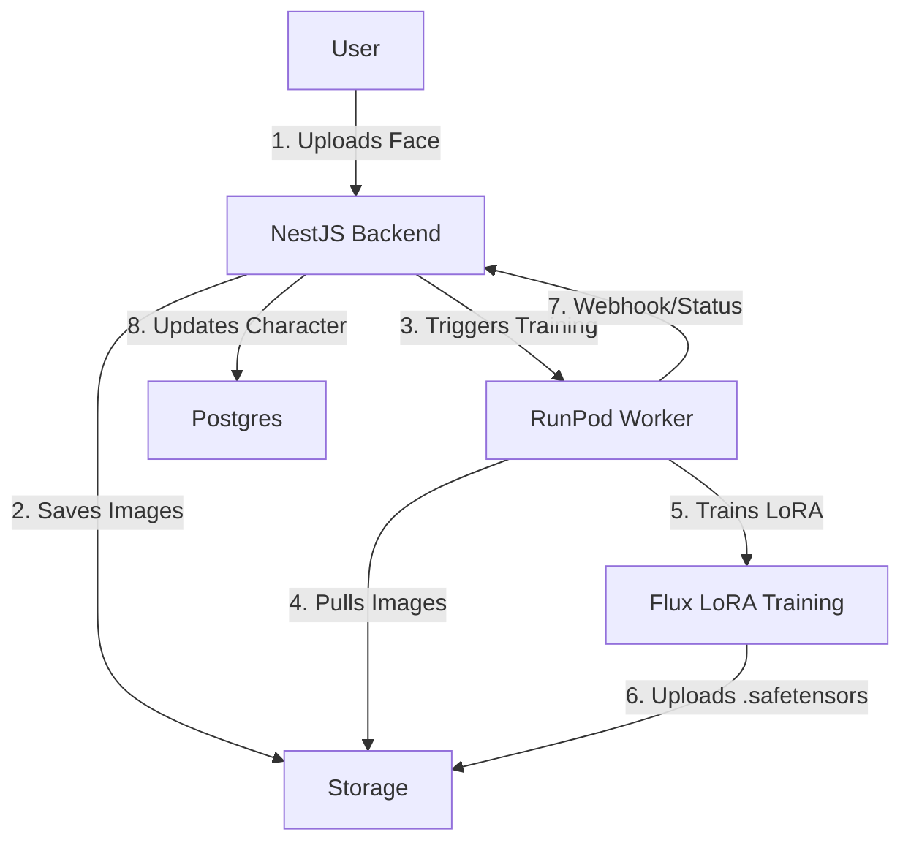

# RunPod Flux LoRA Training Plan

## Overview
Based on `docs/research/youtube-videos/RESEARCH-SUMMARY.md`, we will implement a **Flux LoRA Training Pipeline** on RunPod to enable consistent character generation for the "Content Studio" (EP-005).

## Architecture

## Why Backend First?
The NestJS backend acts as the **Orchestrator**. It must be set up first to:
1.  **Authenticate Users** (EP-002): Only valid users can start expensive training jobs.
2.  **Store Character Data** (EP-001): We need a `Character` entity to attach the LoRA model to.
3.  **Manage State**: Track training status (`pending` -> `training` -> `completed`).
4.  **Handle Webhooks**: Receive callbacks from RunPod when training finishes.

## RunPod Setup Plan (using MCP)

### 1. Define Worker Image
We will need a Docker image capable of:
- Running `kohya_ss` or similar training scripts for Flux.
- Accepting input images via URL/S3.
- Outputting `.safetensors` files.

*Action*: Research/Select a "Flux Training" template on RunPod or build a custom Dockerfile.

### 2. Infrastructure Management (MCP)
We will use the `runpod` MCP tool to:
- **Development**: Create/Start a "Persistent Pod" for testing training scripts manually.
- **Production**: Create a "Serverless Endpoint" (Network Volume + Worker) that scales to 0 when not in use to save costs ($0.22/hr vs $0 when idle).

### 3. Integration Logic (Backend)
- **Service**: `RunPodService` in NestJS.
- **Method**: `startTraining(characterId: string, imageUrls: string[])`
- **Implementation**:
  - Call RunPod API to start job.
  - Update DB status to `TRAINING`.

## Updated Approach: AI Toolkit

**Status**: Updated 2025-01-27

Based on research from [Hyperrealistic Consistent Characters Workflow](../../../research/youtube-videos/PhiPASFYBmk/analysis.md), we're using **AI Toolkit** (by Ostrus AI) instead of custom training scripts.

**Why AI Toolkit**:
- ✅ Available as RunPod template (easy deployment)
- ✅ Supports One 2.1/2.2, Flux, and other models
- ✅ Web-based interface with HTTP API
- ✅ Proven solution with good documentation
- ✅ Cost-effective (~$4 per LoRA)

**See**: [AI Toolkit LoRA Training Integration](./AI-TOOLKIT-LORA-TRAINING.md) for full implementation plan.

## Next Steps
1.  **Deploy AI Toolkit Pod**: Use RunPod template "AI Toolkit" by Ostrus
2.  **Discover API Endpoints**: Reverse-engineer HTTP API from web UI
3.  **Implement Client**: Create `AIToolkitClient` with real endpoints
4.  **Implement Service**: Create `LoraTrainingService` in backend
5.  **Add Automation**: Hook into character sheet completion

